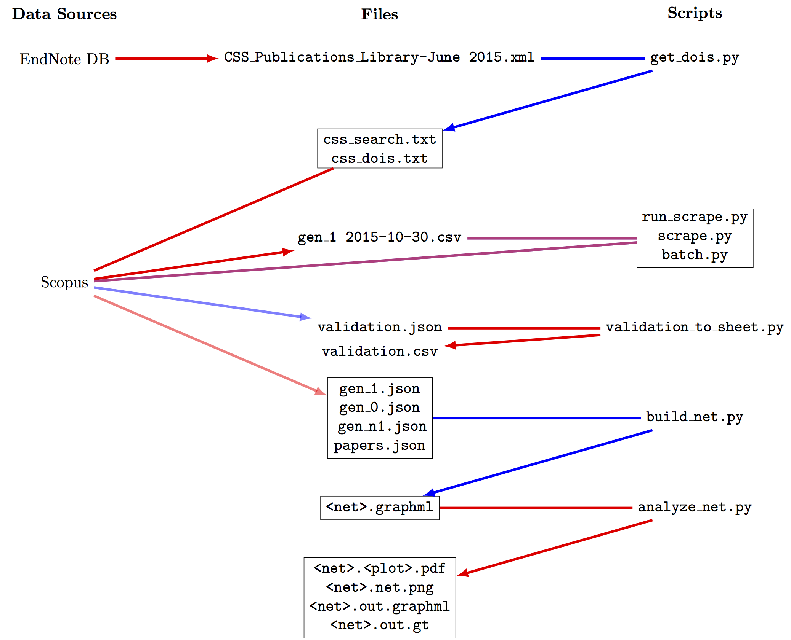

# Overview

This repository contains several tools for citation network construction and analysis, originally developed for the project described in `bibliometrics.pdf`.  The folders contain a series of Python 3 scripts, intended to be used sequentially as follows:  

* `get_dois`:  Starting with a `xml` file exported from EndNote, extract a list of DOIs and a search string that can be copied and pasted directly into Scopus' advanced search box.  

* In Scopus, manually retrieve "generation 1."  (See the project description for an explanation for this term.)  

* `scrape`:  Starting with the `csv` file for generation 1, retrieve the desired metadata.  
	- `scrape.get_meta_by_doi`, which actually builds the query for the Scopus API, assumes that an API key has been defined as `MY_API_KEY` in `api_key.py`.  A new Scopus API key can be generated by registering for free [on the Scopus API page](http://dev.elsevier.com/index.html).  
	- My project required retrieving metadata for something like 30-50,000 articles.  
	- Since the Scopus API being used has a limit cap of something like 2,000 articles per week, I contacted Scopus to arrange for a limit cap raise.  It took a few weeks to negotiate the cap raise.  
	- The raised cap was still too low to retrieve all of the required metadata in one run.  The module `batch.py` was written to break the retrieval list into manageable chunks.  
	- `run_scrape.py` actually works through the metadata retrieval process.  
	
* `build_net`:  Using the metadata retrieved from Scopus, build citation and coauthor networks.  Each of the resulting `graphml` files contains a single connected network.  
	- Installing `graph_tool` is [nontrivial](http://graph-tool.skewed.de/download).  However, especially if compiled with the `--enable-openmp` flag, it is significantly faster than any of the other major Python network analysis packages.  
	
* `analyze_net`:  Using the `graphml` files and two "comparison networks," conduct the actual network analysis.  
	- The "comparison networks" are citation networks grabbed from arXiv, with papers from January 1993 to April 2003.  They can be found [here](https://snap.stanford.edu/data/cit-HepPh.html) and [here](https://snap.stanford.edu/data/cit-HepTh.html).  
	
* `ida.R`: IMO, Python is better for manipulating complex data structures, but R has better tools for generating publication-quality tables and plots, and a nicer interactive IDE.  This R file helps us do this with the `graphml` files generated by `analyze_net`.  

# Major To-dos

* `downstream.py`: Documentation, this readme, flow diagram